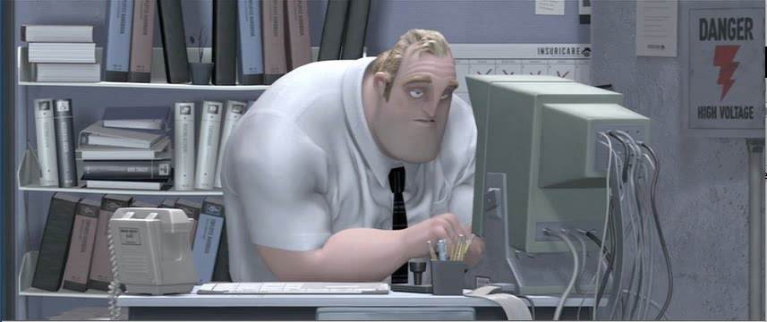

*What about software science?*

# So like, what's the deal?

At the time of writing I am currently taking ICS 314, a computer science course, to fulfill a technical requirement for my computer engineering curriculum. Computer engineering is a subset of electrical engineering with a focus on software integration of systems. We do a lot more programming and algorithms than electrical engineers. In lieu, we do not have to do as much electromagnetic physics and signals processing. I think that is a fair trade! On my senior year I accumulated a fair bit of programming knowledge so far but have only been subject to classroom examples. ICS 314 has provided me opportunities to write functional programs for real world scenarios with real world data. It has only been a handful of weeks so far, but I can certainly see my skills formalize.

# Up, up, and away!

Now that I am starting to get practical skills and experiences underneath my belt is time to ask what do I expect or dream of being able to do. As a computer engineer I am still separate from computer science or software engineering, near pure programming positions. I still am trying to build up and develop my hardware based skills and the skills that bridge the gap between hardware and software. The most obvious example of skill development for this question is working with Linux, something I have done before for class, but need to do for my own time. My excuse is lack of motivation, but Microsoft is happy to give me some every security update for Windows 11. What I need to do for myself is to create a plan.

# Something, something, year of Linux

My goals for myself in my final year at Manoa is to create dual boot environment for Linux on my personal computers for personal purposes, not assignments. I need to become more acquainted with the software, especially given the motivation of Windows 11 perpetually slowing down my machine and the threat of forced update of my Windows 10 machine. My hopes is by being more familiar with the platform I will become much more comfortable in test bench environments that my future job may require or future passion projects, like Raspberry Pi. ICS 314, while not a class on Linux, offers me opportunities to develop not my programming skills but my development skills in the form of creating this portfolio, the final project website, and setting up personalized IDEs. It is my plan to continue these skills to be able to create more passion projects that can better represent who I am and who I wish to be.
