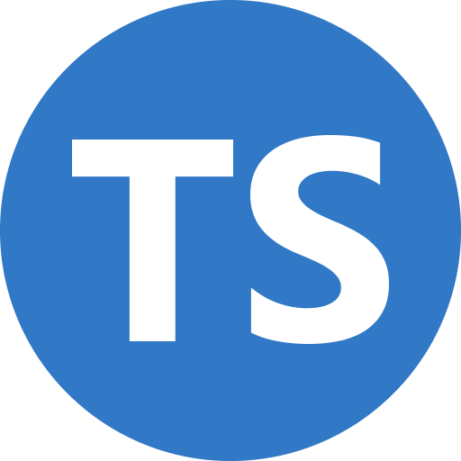

*Cautiously enjoying coding in TypeScript*

For ICS 314 the primary language of focus has been TypeScript, a derivative of JavaScript whose whole shtick is the ability to create and manipulate data types to better suit the needs of the program. My experience with programming up until this point were a couple of engineering courses. My first being Programming for Engineer's, baby's first programming language, introducing the baseline concepts of programming through Python, and Object Oriented Programming which dove deeper into functions, classes, and file management by using C and C++.

Other classes utilized Python and C++ intermittently: my linear algebra course using a lot of numpy, and my data structures course using a lot of C and C++. These courses helped further reinforce the methods and means of using programming to solve mathematical problems. But number crunching fictitious values gets tiring.

## Bringing the Fun, in Functional Programming

At the time of writing it has been only a few weeks of classes, a few weeks of ICS 314 and learning TypeScript. Daily coding problems have been assigned with a wide variety of applications, weather calculators, cornhole scoring databases, and a Jamba Juice stockpiling program. With barely any knowledge of TypeScript, I was able to quickly adapt and apply the ground work of computer progamming to the new language while simultaneously working towards a goal that has a concievable successful end. Performing matrix math is meaningless if you don't know what it spat out is correct.

ICS 314's real world applications have been an immense help in bringing the classroom to relevancy. But not to discredit the other courses I have taken, their purpose was to provide me a toolbox of knowledge and methods to solve programming problems. ICS 314 has provided me a canvas with a fictional buyer behind, allowing me to flex my creativity and design programs with a purpose.

## So Far, So Good

So far all of my programming with TypeScript has been browser based making quick scratch programs easy to create and compile, as compared to the C's and Python needing their own environment. The browser editor and the language itself have been very forgiving and straightfoward, namely in using and developing classes. I have always known what classes are, and I have worked with them before, but for some reason the knowledge fizzles away in my memory. TypeScript has helped cement this skill in my memory by simplifying the concept, making it way more approachable and memorable.

Working with classes and functions have been very identical to C++ and Python, therefore by being adept at TypeScript I further increase my prowess in those languages helping me feel confident I can code depending on the situation.

## Let's See What Happens Next

Like I said, at the time of writing it has only been a couple of weeks being in ICS 314, and only a few weeks learning TypeScript. I am sure, there will be a time in the future where I raise my hand in a fist and curse the langauge and its design (like what I have done for C, C++, and Python). But for now, learning TypeScript in ICS 314 has been an enjoyable and informative experience making me eager to see what other applications there are that I never knew I could solve.
