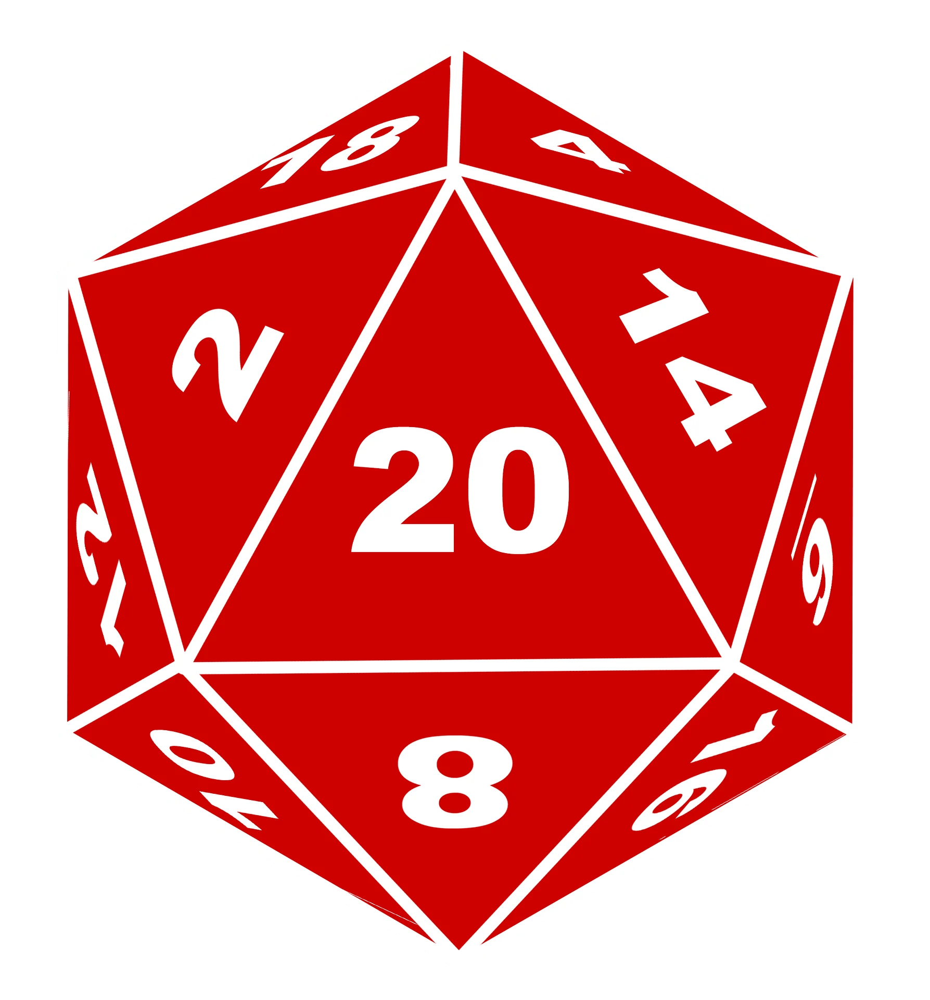

*In hindsight I never gave my game a name. I feel at this rate it is too late.*

To learn about file management and classes ECE 205's main assignment was to create an RPG game that can do character customizations with names, attributes, classes, and races to then go on a little adventure to fight what ever comes your way. A very, very short, and severely unpolished game, that was plenty of fun to create. Another aspect of this assignment was to trade files of our player classes. We had to learn how to make do with something we have not created in order to make our own product.

``
"start":"tavern",
  "tavern":{"setting": "You find yourself situated in a local pub known as Broski Brewksi Bros. Brewskis, a local favorite.\n\nAfter downing your fifth fifth of a pint, the bartender Broski tells you a tale of wonderous treasures for you to adventure out and get, especially since you never pay your tab\nThe treausre lies in a tower, but how to get there varies.",
	  "choices": "===Either head to the forest (0) or the mountains (1)===",
	  "destination": ["forest","mountains"],
	 "triggerBattle":false},
``

Example code from the JSON that contained the events. Contains information about the location and where the player can choose to go, as well as whether the location is a battle.

Source Code: https://github.com/LyingCakes/ece205-lab14a-RPGbeta-LyingCakes
